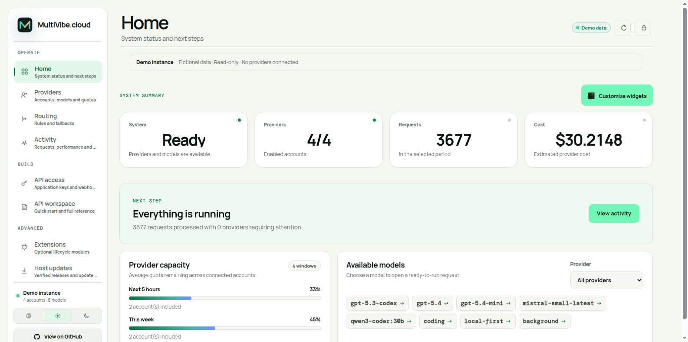

<p align="center">
  <a href="https://multivibe.cloud">
    <picture>
      <source media="(prefers-color-scheme: dark)" srcset="./assets/brand/vector/multivibe-logo-domain-dark-outlined.svg" />
      <source media="(prefers-color-scheme: light)" srcset="./assets/brand/vector/multivibe-logo-domain-light-outlined.svg" />
      
    </picture>
  </a>
</p>

<p align="center">
  <strong>Your providers. Your hardware. One AI gateway.</strong>
</p>

<p align="center">
  <a href="https://github.com/thibautrey/multivibe/releases/latest"></a>
  <a href="https://github.com/thibautrey/multivibe/releases"></a>
  <a href="https://github.com/thibautrey/multivibe"></a>
  <a href="./LICENSE"></a>
</p>

<p align="center">
  A free, self-hosted gateway for coding agents and AI apps.<br />
  Connect provider accounts, route around quotas, and run models on your own supported hardware.
</p>

<p align="center">
  <a href="#download-multivibe-host"><strong>Download MultiVibe Host</strong></a> ·
  <a href="https://github.com/thibautrey/multivibe/wiki/Quick-start#-quick-start"><strong>Run the gateway</strong></a> ·
  <a href="https://github.com/thibautrey/multivibe/wiki/API-reference#-api-surface">Explore the API</a> ·
  <a href="https://github.com/thibautrey/multivibe/wiki/Local-development">Contribute</a>
</p>


<p align="center">
  <a href="https://github.com/thibautrey/multivibe/wiki/Dashboard"></a>
  <br />
  <sub>Current dashboard · Fictional data from the local demo instance</sub>
</p>

## ✨ At a glance

| One endpoint | Resilient routing | Your infrastructure |
| --- | --- | --- |
| Connect OpenAI-compatible clients, Codex, and Anthropic Messages clients. | Discover models, balance quota headroom, and fail over between accounts. | Self-host the gateway or run the complete Host on supported hardware. |
| Responses, Chat Completions, SSE, Realtime, and WebSocket support. | Add model aliases, local/cloud policies, budgets, and deferred jobs. | Manage API keys, inspect traces, and track tokens, costs, and latency. |

<details>
<summary><strong>Full capabilities and gateway architecture</strong></summary>

| Area | What MultiVibe provides |
| --- | --- |
| Client APIs | Responses, Chat Completions, Anthropic Messages, models, Realtime WebRTC, SSE, and Responses over WebSocket |
| Providers | OpenAI/ChatGPT, generic OpenAI-compatible APIs, OpenCode Zen/Go, Mistral, z.ai Coding Plan, and Grok Build subscriptions |
| Account routing | Automatic model discovery, quota headroom selection, account/model blocks, retries, and optional Codex session affinity |
| Smart aliases | Conditional schema-v2 policies, local/cloud candidates, capacity constraints, scoring, budgets, simulation, and queue/reject fallbacks |
| Deferred work | Durable edge jobs, priority and application fairness, idempotency, polling/SSE results, cancellation, and signed webhooks |
| Operations | Admin dashboard, lifecycle plugins, dynamic application API keys, traces, cost/token/latency statistics, project attribution, exports, and Sentry integration |

MultiVibe exposes the same inference routes under `/v1` and at the root for
clients that expect either style. In the shipped Compose profile, the public
`:1455` socket is served directly by the native Rust edge; Node.js remains on
loopback `127.0.0.1:1456` for the dashboard, OAuth, static assets, and
control-plane routes. Compatibility endpoints for Ollama- and LiteLLM-style
discovery are also available.

</details>

### Find your way

| Get started | Use the gateway | Operate and extend |
| --- | --- | --- |
| [Download the Host](#download-multivibe-host) | [Providers and onboarding](https://github.com/thibautrey/multivibe/wiki/Providers-and-onboarding#-providers-and-onboarding) | [Tracing and projects](https://github.com/thibautrey/multivibe/wiki/Tracing-and-projects#-tracing-and-project-attribution) |
| [Gateway quick start](https://github.com/thibautrey/multivibe/wiki/Quick-start#-quick-start) | [API reference and examples](https://github.com/thibautrey/multivibe/wiki/API-reference#-api-surface) | [Storage and local models](https://github.com/thibautrey/multivibe/wiki/Persistence-and-local-models#-persistence) |
| [Dashboard tour](https://github.com/thibautrey/multivibe/wiki/Dashboard) | [Routing and aliases](https://github.com/thibautrey/multivibe/wiki/Routing-and-aliases#-routing-strategy) | [Configuration](https://github.com/thibautrey/multivibe/wiki/Configuration) |
| [Installation guide](./packaging/PROVIDER-HOST-README.md) | [Plugins](https://github.com/thibautrey/multivibe/wiki/Plugins-overview#-plugins) | [Development](https://github.com/thibautrey/multivibe/wiki/Local-development) · [More docs](https://github.com/thibautrey/multivibe/wiki/Home) |

---

<a id="download-multivibe-host"></a>

## ⬇️ Download MultiVibe Host

MultiVibe Host is the fastest way to run the complete, security-bounded local
Host: gateway, dashboard, private device identity, provider agent, and managed
model runtime. Official builds are published together in one verified release.

| Platform | Official package | Requirements | Download |
| --- | --- | --- | --- |
| **macOS** | Signed and notarized `.dmg` for Apple Silicon and Intel | Apple Silicon (`arm64`) or Intel (`amd64`) Mac | **[Download the latest macOS release →](https://github.com/thibautrey/multivibe/releases/latest)** |
| **Linux** | Signed native Host archive | Linux `x86_64` with an NVIDIA GPU, compute capability 7.0+ | **[Download the latest Linux release →](https://github.com/thibautrey/multivibe/releases/latest)** |
| **Windows** | Verified native `.zip` for amd64 | Windows amd64 with an NVIDIA GPU, compute capability 7.0+ | **[Download the latest Windows release →](https://github.com/thibautrey/multivibe/releases/latest)** |
| **Docker / Unraid** | Hardened image on GitHub Container Registry | Linux `x86_64`, Docker or Unraid, NVIDIA container runtime | **[Open the latest Docker release →](https://github.com/thibautrey/multivibe/releases/latest)** |

<details>
<summary><strong>macOS installation</strong></summary>

### macOS

Open the latest release and choose the disk image for your Mac:

- `darwin_arm64.dmg` for Apple Silicon (M1 or newer)
- `darwin_amd64.dmg` for Intel

Open the DMG, drag **MultiVibe Host** to **Applications**, then launch it. The
app is signed with Developer ID, notarized by Apple, and runs from the menu bar.
Its menu-bar label shows aggregate remaining OpenAI weekly and five-hour
capacity when available. Opening it presents a native account overview with
per-account quota windows, reset times, and health without exposing account
tokens to the interface process.

</details>

<details>
<summary><strong>Linux installation</strong></summary>

### Linux

Download the Linux `amd64` release assets and follow `NATIVE-MULTIPART.txt` when
the archive is split into several parts. After reconstructing and extracting
the archive, run:

```sh
./install.sh
```

The installer verifies the release and supported NVIDIA hardware before it
starts the Host. It installs for the current user and does not require root.
On systems with a user systemd manager it also enables the signed automatic
update timer. The timer checks hourly but the updater itself schedules one
network check every 10 to 14 hours with a local random offset.

</details>

<details>
<summary><strong>Windows installation</strong></summary>

### Windows

Download the `windows_amd64.zip` release, extract it to a temporary directory,
then run PowerShell as the current user:

```powershell
powershell.exe -NoProfile -ExecutionPolicy Bypass -File .\install.ps1
```

The installer verifies the complete bundle and the local NVIDIA driver before
it changes the machine. It requires Windows amd64 and a GPU with compute
capability 7.0 or newer, installs without administrator privileges, and
registers a per-user Start Menu shortcut, login entry, `multivibe://` protocol
handler, and scheduled update task. The native Win32 tray menu starts and
stops the Host and opens the local dashboard. Application files are kept under
`%LOCALAPPDATA%\Programs\MultiVibe Host`; private state and logs remain under
`%LOCALAPPDATA%\MultiVibe`.

PowerShell 5.1 or newer is required. The Windows updater verifies the signed
feed and ZIP contents, stops only MultiVibe processes whose executable paths
belong to the managed installation, and restores the previous version if the
new Host does not pass its health check.

</details>

<details>
<summary><strong>Docker and Unraid installation</strong></summary>

### Docker and Unraid

The current Host release workflow publishes the same verified Linux bundle to
GHCR as both an immutable version and the rolling `latest` tag:

```sh
docker pull ghcr.io/thibautrey/multivibe-host:latest
```

For reproducible deployments, use the versioned tag or immutable digest shown
in the matching [latest GitHub release](https://github.com/thibautrey/multivibe/releases/latest).
For Unraid, see the [installation and Community Applications submission guide](packaging/unraid/README.md). The template is available for manual installation; a public store listing still requires Community Applications acceptance.

Docker Compose and Unraid setup are documented in
[Provider Host container](https://github.com/thibautrey/multivibe/wiki/Persistence-and-local-models#provider-host-container-docker-compose-and-unraid).

</details>

### Updates and release verification

Native macOS, Linux, and Windows installations check an authenticated release feed and,
by default, download and install an eligible stable release while the Host is
idle. The updater drains new work, waits for active requests and model
operations, verifies the archive with an embedded Ed25519 trust root, stages
the replacement, and restores the previous version if the restarted Host does
not pass its health check. The dashboard and macOS menu bar can switch between
automatic installation, automatic download, and notification-only modes.

Containers never receive the Docker socket and never replace themselves. For
generic Docker Compose, install the host-side updater from the verified Linux
archive. Unraid users may use the platform's automatic application update
mechanism with the published `latest` tag.

> [!NOTE]
> If GHCR reports that the package is not found, no tagged Host release with
> Docker publishing has completed yet. Use an official native release or build
> from this repository instead of installing an unverified third-party image.

> [!TIP]
> Native archives include signed checksums, SBOMs, and GitHub build-provenance
> attestations. See the [verification and installation guide](./packaging/PROVIDER-HOST-README.md)
> before deploying a Host on shared or production infrastructure.


## 📚 Documentation

The **[GitHub wiki](https://github.com/thibautrey/multivibe/wiki/Home)** contains the user guides, API reference, configuration, architecture, and historical reports.

- [Quick start](https://github.com/thibautrey/multivibe/wiki/Quick-start)
- [Dashboard](https://github.com/thibautrey/multivibe/wiki/Dashboard)
- [Providers and onboarding](https://github.com/thibautrey/multivibe/wiki/Providers-and-onboarding)
- [API reference](https://github.com/thibautrey/multivibe/wiki/API-reference)
- [Routing and aliases](https://github.com/thibautrey/multivibe/wiki/Routing-and-aliases)
- [Configuration](https://github.com/thibautrey/multivibe/wiki/Configuration)
- [Local development](https://github.com/thibautrey/multivibe/wiki/Local-development)


## 🤝 Contributing

Focused pull requests and issues are welcome. For UI changes, include a
before/after description and screenshots. For behavior changes, add or update
tests and report the validation commands you ran.


## 👥 Contributors

<a href="https://github.com/thibautrey/multivibe/graphs/contributors">
  
</a>

Thanks to everyone who has helped improve MultiVibe. This gallery is generated
from GitHub's contributor graph and updates automatically.

[View all contributors and their commits](https://github.com/thibautrey/multivibe/graphs/contributors).


## 📄 License

The source code in this repository, including MultiVibe Core and its auditable
provider-host agent, is licensed under the [Apache License 2.0](./LICENSE). The
license includes an explicit patent grant and permits inspection, modification,
and redistribution under its terms. It does not grant access to the hosted
multivibe.cloud service, service accounts, credentials, customer data, or
Pleiades Solutions trademarks beyond Apache-2.0 Section 6.


## ⭐ Star History

[View the public star history](https://www.star-history.com/?type=date&repos=thibautrey%2Fmultivibe).
